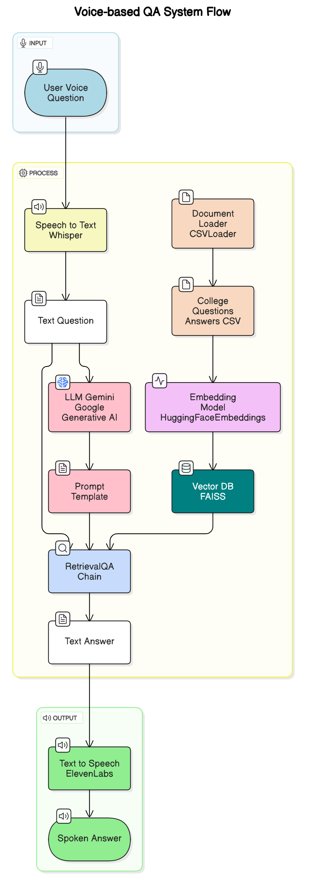

# 📚 College FAQ Assistant using Gemini, LangChain, HuggingFace & FAISS

An intelligent FAQ Assistant that answers college-related questions using real data stored locally.  
Built with **Gemini-Pro**, **LangChain**, **Hugging Face embeddings**, **FAISS**, **Whisper**, and **ElevenLabs** for a seamless multimodal experience.

---
## ✨ Overview


## ✨ Technologies Used

| Technology | Purpose |
|:-----------|:--------|
| [Google Gemini-Pro](https://ai.google.dev/) | LLM for answering questions |
| [LangChain](https://www.langchain.dev/) | Framework to create LLM pipelines |
| [Hugging Face Sentence Transformers](https://www.sbert.net/) | Generate semantic embeddings |
| [FAISS](https://github.com/facebookresearch/faiss) | Fast vector similarity search |
| [OpenAI Whisper](https://openai.com/research/whisper) | Convert speech to text |
| [ElevenLabs](https://www.elevenlabs.io/) | Convert text to speech |
| [Streamlit](https://streamlit.io/) | Frontend web deployment |
| [Python](https://www.python.org/) | Core language |
| [dotenv](https://pypi.org/project/python-dotenv/) | Manage environment variables |

---

## 🛠️ How the Project Works

### 1. 📥 Input Stage (Voice Query)
The system begins when a user **asks a voice-based question** through the web UI (built using Streamlit).

### 2. 🎙️ Speech Recognition via Whisper
The user's voice is transcribed into text using **OpenAI Whisper**, enabling natural voice input.

### 3. 📄 Document Retrieval & Processing
- Loads a local CSV file of admission FAQs using LangChain’s `CSVLoader`.
- Transforms each question into vector embeddings using **HuggingFace MiniLM-L6-v2**.
- Embeddings are stored in a **FAISS** vector database to enable fast semantic search.

### 4. 🔍 Contextual Retrieval via LangChain + FAISS
The system retrieves the most relevant Q&A pairs from the FAISS database based on the user's transcribed question.

### 5. 🧠 Answer Generation using Gemini Pro
Gemini Pro LLM is used to generate a **context-aware, factually consistent** answer using a custom prompt template and retrieved context.

### 6. 🔁 Response Synthesis with ElevenLabs
The generated answer is converted from text to audio using **ElevenLabs**, delivering the spoken answer back to the user.

---

## 🔄 Visual Architecture

### 🔹 Voice-based QA System Flow



**Description**:  
This flow diagram breaks down the core components of the system:
- **Input**: Starts with a voice query.
- **Process**: Uses Whisper for speech-to-text → FAISS + LangChain for document retrieval → Gemini Pro for answer generation.
- **Output**: Converts response back to audio using ElevenLabs, providing a spoken answer to the user.

---

### 🔸 Voice QA System Sequence Diagram


**Description**:  
This sequence diagram visualizes the interaction between each module:
- The **user’s voice query** triggers Whisper for transcription.
- On first run, data is loaded, embedded, and stored in FAISS.
- **LangChain** orchestrates the QA pipeline: retrieves relevant context and queries Gemini LLM.
- The generated answer is passed to **ElevenLabs**, and the result is played back as audio.
- Handles edge cases like empty responses with graceful error messages.
- Supports continuous interaction: user can keep asking new questions in a loop.

---

## 📋 Project Structure

```bash
.
├── college_questions_answers.csv     # Dataset with Q&A
├── faiss_index/                      # FAISS Index (auto-created after first run)
├── .env                              # API Key for Gemini, ElevenLabs, etc.
├── main.py                           # Core logic (Gemini, LangChain, FAISS, UI logic)
├── speech_to_text.py                 # Uses Whisper for voice input
├── text_to_speech.py                 # Uses ElevenLabs for audio output
├── requirements.txt                  # Python dependencies
├── README.md                         # Project documentation
